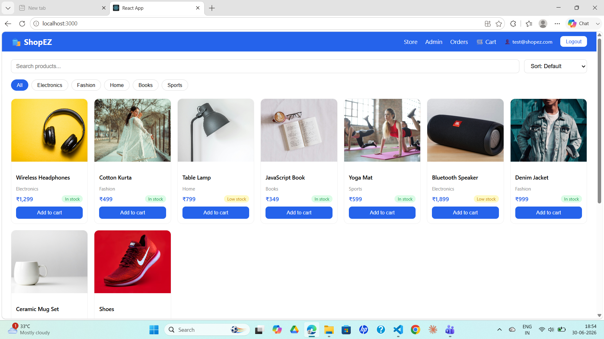
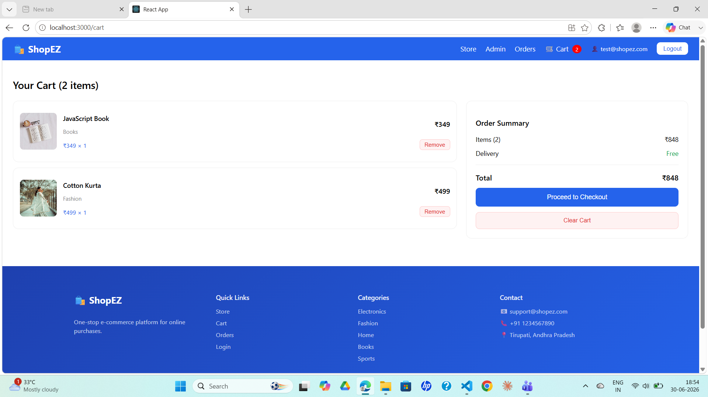
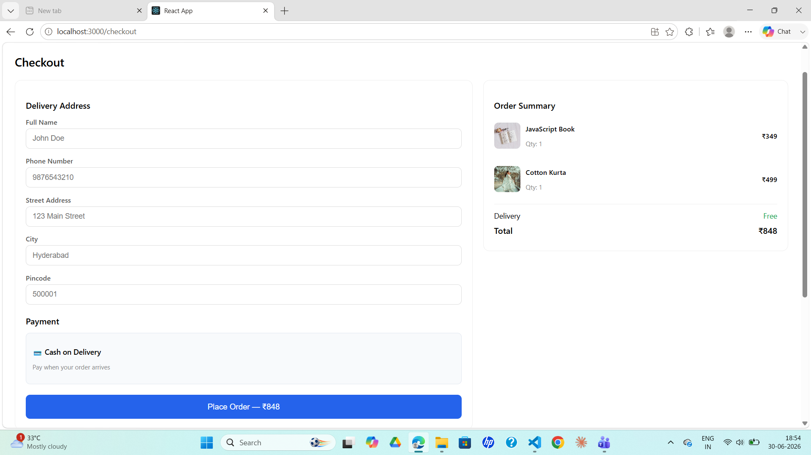
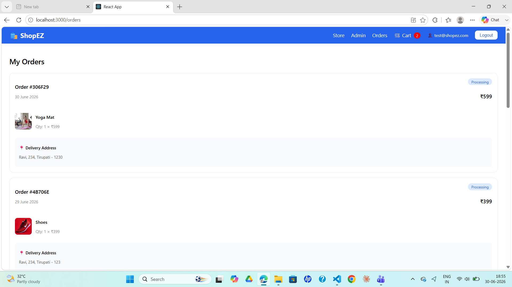
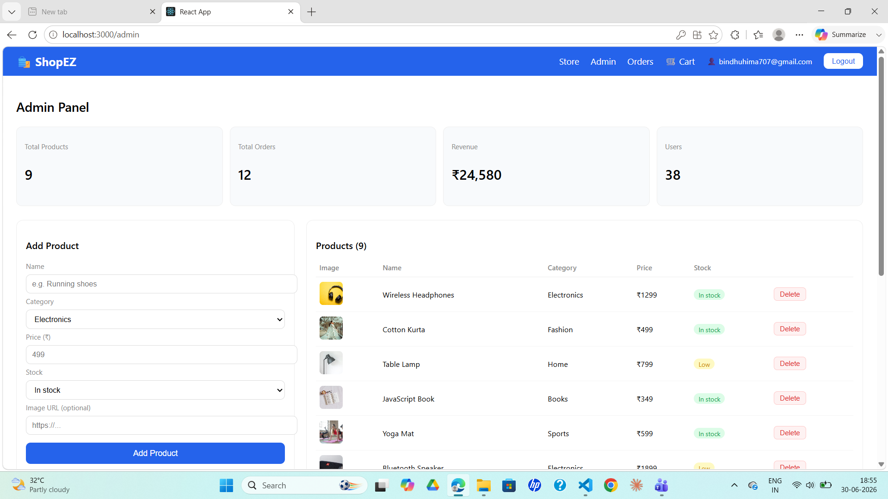
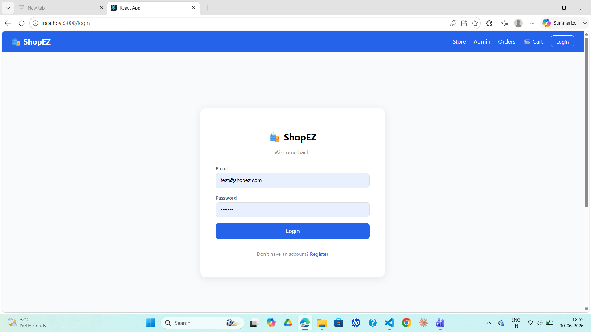

# 🛍️ ShopEZ - One Stop E-Commerce Platform

A full-stack MERN e-commerce application where customers can browse products, add to cart, place orders, and make secure payments.

## 🔗 Repository Links

- Frontend Repo: https://github.com/Himabindhu-123/Shopez
- Backend Repo: https://github.com/Himabindhu-123/shopez-backend

## 🚀 Live Demo

Frontend:

Backend:

## 📸 Features

- 🛒 Product catalog with categories, search, filters, and stock status
- 🛍️ Cart with quantity controls
- 💳 Checkout flow with address and order summary
- 📦 Order history with delivery tracking
- 🔐 Login/Register with Firebase Authentication
- ⚙️ Admin panel for product CRUD (protected by email)
- 📱 Responsive design

## 🖼️ Screenshots

### Home Page


### Cart Page


### Checkout Page


### Order History


### Admin Panel


### Login Page


## 🧰 Tech Stack

**Frontend:**
- React.js
- React Router DOM
- Axios
- Firebase Authentication
- Context API for state management

**Backend:**
- Node.js
- Express.js
- MongoDB with Mongoose
- REST API

## 📁 Project Structure

shopez/                  # React Frontend

├── src/

│   ├── components/      # Navbar, Footer

│   ├── context/         # CartContext

│   ├── pages/           # Home, Cart, Checkout, Orders, Admin, Login

│   └── firebase.js      # Firebase config

shopez-backend/          # Node/Express Backend

├── models/              # Product, Order schemas

├── routes/              # products, orders API routes

└── server.js            # Entry point

## ⚙️ Installation & Setup

### Backend

```bash
cd shopez-backend
npm install
# Create .env file with:
# MONGO_URI=your_mongodb_uri
# PORT=5000
node server.js
```

### Frontend

```bash
cd shopez
npm install
# Create .env file with Firebase config
npm start
```

### 🔑 Environment Variables

### Frontend (.env)

```bash
REACT_APP_FIREBASE_API_KEY=

REACT_APP_FIREBASE_AUTH_DOMAIN=

REACT_APP_FIREBASE_PROJECT_ID=

REACT_APP_FIREBASE_STORAGE_BUCKET=

REACT_APP_FIREBASE_MESSAGING_SENDER_ID=

REACT_APP_FIREBASE_APP_ID=
```

### Backend (.env)

```bash
MONGO_URI=

PORT=5000
```

## 🔮 Future Enhancements

- 💳 Integrate real payment gateway (Razorpay/Stripe) instead of Cash on Delivery
- ⭐ Add product reviews and ratings
- ❤️ Add wishlist feature
- 🔍 Advanced filters (price range, ratings)
- 📊 Admin dashboard with sales charts and analytics
- 📧 Email notifications for order confirmation
- 🔁 Order status tracking (Processing → Shipped → Delivered) updated by admin
- 🌙 Dark mode support
- 🗣️ Multi-language support

## 👩‍💻 Author
Himabindhu Ravuri